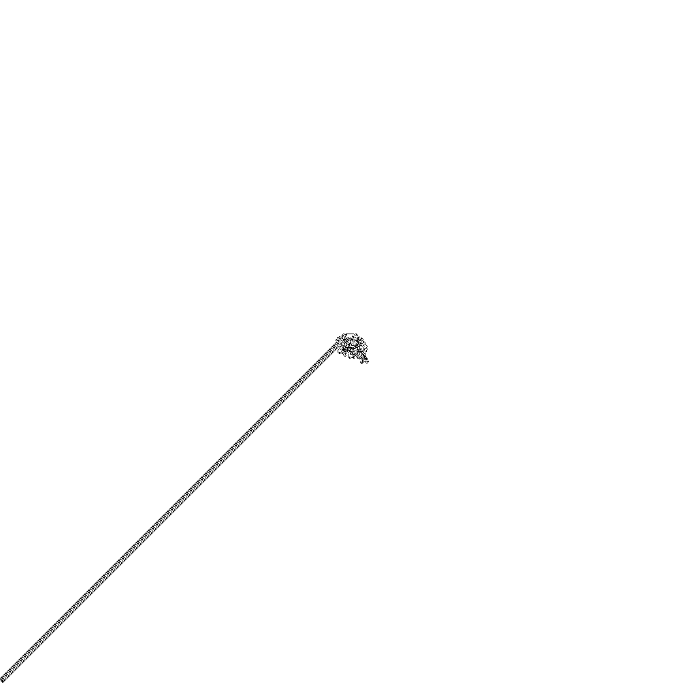

# Testovoye-muravei

+Решение #1
```
Line #    Mem usage    Increment  Occurrences   Line Contents
=============================================================
     4     23.2 MiB     23.2 MiB           1   @profile
     5                                         def ant_path(width, height):
     6                                             # Используем list comprehension для создания поля с белыми клетками
     7     32.5 MiB      9.3 MiB     1051651       pixels = [[1 for _ in range(width)] for _ in range(height)]
     8     32.5 MiB      0.0 MiB           1       x, y = width // 2, height // 2  # Начальные координаты муравья
     9     32.5 MiB      0.0 MiB           1       direction = 0  # Начальное направление (0 - вверх, 1 - вправо, 2 - вниз, 3 - влево)  
    10
    11     32.5 MiB      0.0 MiB       35694       while 0 <= x < width and 0 <= y < height:
    12     32.5 MiB      0.0 MiB       35693           if pixels[y][x] == 1:  # Если клетка белая
    13     32.5 MiB      0.0 MiB       19688               direction = (direction + 1) % 4  # Поворачиваем на 90° по часовой стрелке    
    14     32.5 MiB      0.0 MiB       19688               pixels[y][x] = 0  # Инвертируем пиксель (черный)
    15                                                 else:  # Если клетка черная
    16     32.5 MiB      0.0 MiB       16005               direction = (direction - 1) % 4  # Поворачиваем на 90° против часовой стрелки
    17     32.5 MiB      0.0 MiB       16005               pixels[y][x] = 1  # Инвертируем пиксель (белый)
    18
    19                                                 # Перемещаем муравья вперед на одну клетку в зависимости от направления
    20     32.5 MiB      0.0 MiB       35693           if direction == 0:  # Вверх
    21     32.5 MiB      0.0 MiB        8680               y -= 1
    22     32.5 MiB      0.0 MiB       27013           elif direction == 1:  # Вправо
    23     32.5 MiB      0.0 MiB        8667               x += 1
    24     32.5 MiB      0.0 MiB       18346           elif direction == 2:  # Вниз
    25     32.5 MiB      0.0 MiB        9166               y += 1
    26     32.5 MiB      0.0 MiB        9180           elif direction == 3:  # Влево
    27     32.5 MiB      0.0 MiB        9180               x -= 1
    28
    29                                             # Создаем изображение из списка пикселей
    30     33.5 MiB      1.0 MiB           1       image = Image.new("1", (width, height))
    31     41.5 MiB  -1602.5 MiB     1049603       image.putdata([pixel for row in pixels for pixel in row])
    32     34.5 MiB     -7.0 MiB           1       image.save("ant_path.png")
    33     34.5 MiB      0.0 MiB           1       return image
```

